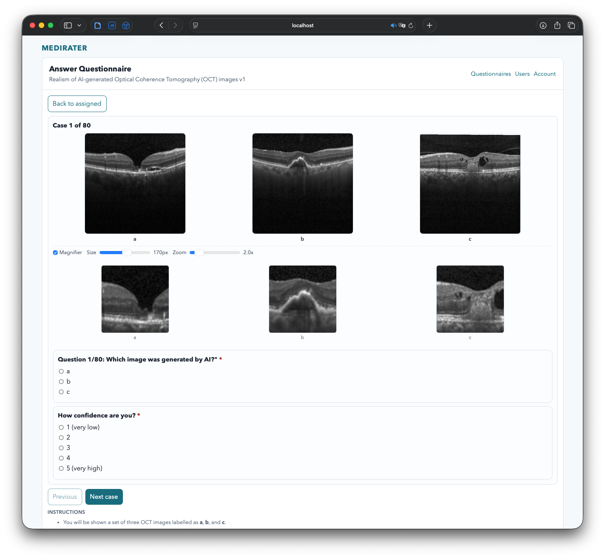
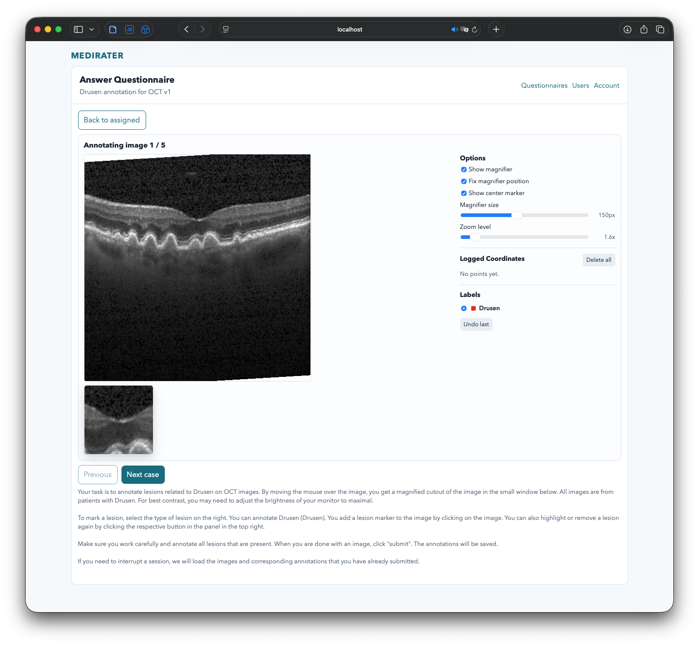

# Medirater

`medirater` is a questionaire web app for evalutating medical images.

### Screenshots

**Evaluater**



**Annotator**



## Install and run it locally

```bash
uv sync --dev
cp .env.example .env
```

For local run, keep at least:

```env
APP_WEBAUTHN_RP_ID=localhost
APP_WEBAUTHN_ORIGIN=http://localhost:8000
```

```bash
uv run uvicorn app.main:app --reload --host 127.0.0.1 --port 8000
```

The app is available at: http://localhost:8000/

To register a superadmin account, open another terminal session, and generate a one-time signup token:

```bash
uv run python scripts/create_bootstrap_token.py --expires-in-minutes 120
```

Use that token at:

- `http://localhost:8000/admin/signup`

After creating the first superadmin account, manage signup mode and invite tokens from:

- `http://localhost:8000/users`